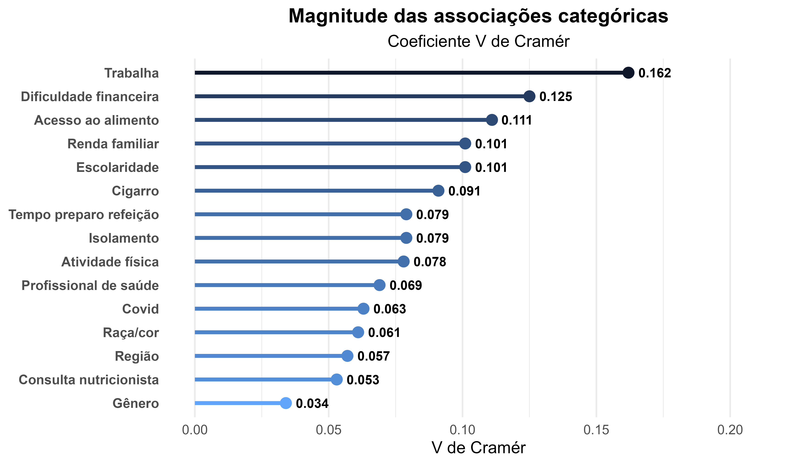
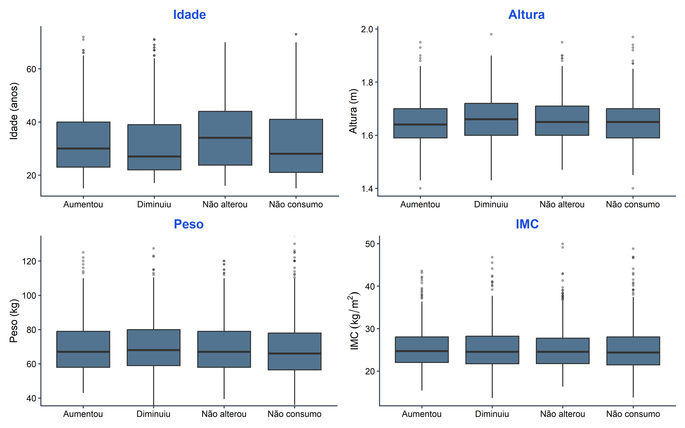
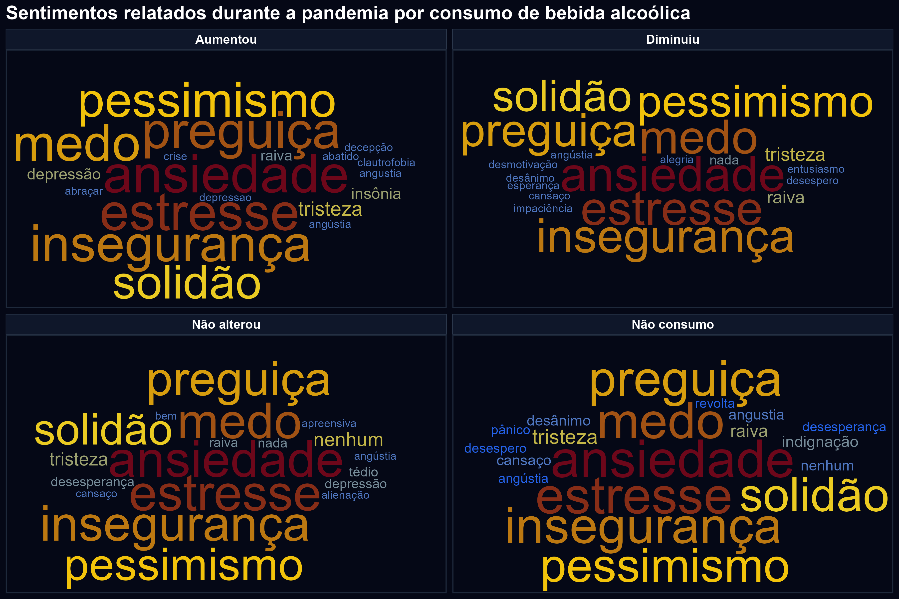

```{r}
library(gt)
library(gtsummary)

tabela <- readRDS("tabela_quali.rds")
tabela2 <- readRDS("tabela_quanti.rds")
```

#  Introdução: {.section-background}

## Contextualização:

:::: {.columns}

::: {.column width="50%"}

::: {.box-blue}

- A pandemia da COVID-19 provocou mudanças sociais, econômicas e comportamentais.

- O isolamento social impactou hábitos alimentares e padrões de consumo.

- Alterações emocionais podem ter influenciado o consumo de bebidas alcoólicas.

:::

:::

::: {.column width="10%"}

:::

::: {.column width="40%"}

::: {.box-yellow}

**Problema de pesquisa**

- Quais fatores estão associados às mudanças no consumo de bebidas alcoólicas durante a pandemia?

:::

:::

::::

<br>

::: {.box-gray}

**Objetivo**

- Avaliar a associação entre a variável **Bebidas_Alcoolicas** e fatores sociodemográficos, econômicos, comportamentais e emocionais.

:::

# Metodologia: {.section-background}

## Base do estudo e variáveis

:::: {.columns}

::: {.column width="45%"}

::: {.box-yellow}

**Base do estudo:**

- Questionário online (2022);
- 2310 indivíduos.

:::

<br>

::: {.box-blue}

**Variável resposta:**

- Bebidas_Alcoolicas.

Categorias:

- Aumentou;
- Diminuiu;
- Não alterou;
- Não consumo.

:::

:::

::: {.column width="5%"}

:::

::: {.column width="45%"}

::: {.box-gray}

**Variáveis categóricas:**

- Sociodemográficas;
- Econômicas;
- Comportamentais.

:::

<br>

::: {.box-yellow}

**Variáveis contínuas:**

- Idade;
- Altura;
- Peso;
- IMC.

:::

<br>

::: {.box-blue}

**Questão aberta:**

- sentimentos_pandemia.

:::

:::

::::

## Métodos estatísticos

:::: {.columns}

::: {.column width="48%"}

::: {.box-blue}

**Variáveis categóricas**

- Qui-quadrado → associação entre categorias;
- Fisher → frequências esperadas pequenas;
- V de Cramér → intensidade da associação;
- Resíduos padronizados → caselas influentes.

**Funções utilizadas no R**

- chisq.test, fisher.test, cramer_v.

:::

:::

::: {.column width="4%"}

:::

::: {.column width="48%"}

::: {.box-yellow}

**Variáveis quantitativas**

::: {.metodos-table}

| Método | Uso | Pós-teste |
|---|---|---|
| ANOVA | Variâncias homogêneas | Tukey |
| Welch | Variâncias heterogêneas | Games-Howell |

:::

**Funções utilizadas no R**

- aov, oneway.test, TukeyHSD, games_howell_test.

**Pressupostos**

- densidade;
- QQ-plot;
- Levene;
- Bartlett.

**Funções utilizadas**

- ggplot, leveneTest, bartlett.test.

$$
\alpha = 5\%
$$

:::

:::

::::

:::


#  Resultados {.section-background}

## Tabela qualitativa {.scrollable}

```{r}
tabela
```


##


#  Perfil dos grupos: {.section-background}

## Como os grupos se comportam?

:::: {.columns}

::: {.column width="45%"}

::: {.box-yellow}

**Maior chance de AUMENTAR o consumo**

- Pessoas que trabalham;
- Maior renda;
- Maior escolaridade;
- Fumantes;
- Reduziram atividade física.

:::

:::

::: {.column width="5%"}

:::

::: {.column width="50%"}

::: {.box-gray}

**Maior chance de NÃO CONSUMIR**

- Dificuldade financeira;
- Dificuldade de acesso a alimentos;
- Pessoas que não trabalham.

:::

:::

::::

<br>

**Principais associações**

:::: {.columns}

::: {.column width="45%"}

::: {.box-blue}

**Sem associação significativa**

- Gênero;
- Raça/Cor;
- Consulta com nutricionista.

:::

:::

::: {.column width="5%"}

:::

::: {.column width="50%"}

::: {.box-yellow}

**Associações significativas**

- Trabalho;
- Renda familiar;
- Escolaridade;
- Dificuldade financeira;
- Acesso a alimentos;
- Isolamento social;
- Tabagismo;
- Atividade física;
- Tempo de preparo das refeições.

:::

:::

::::

#  Variáveis quantitativas: {.section-background}

## Tabela quantitativa {.scrollable}

::: {.panel-tabset}

### Tabela

```{r}
tabela2
```

### Boxplot

:::: {.columns}

::: {.column width="65%"}



:::

::: {.column width="35%"}

::: {.box-yellow}

**Idade**

- Associação significativa;
- Grupo “Não alterou” apresentou maior média de idade.

:::

<br>

::: {.box-gray}

**Altura**

- Diferença estatística significativa;
- Baixa relevância prática.

:::

<br>

::: {.box-blue}

**Peso e IMC**

- Médias semelhantes entre os grupos;
- Sem associação significativa.

:::

:::

::::

:::

# Aspectos emocionais: {.section-background}

## Nuvem de palavras




##


::: {.box-blue}

**Sentimentos predominantes:**

- Ansiedade;
- Medo;
- Estresse;
- Insegurança;
- Solidão.

:::

<br>

::: {.box-yellow}

**Interpretação:**

Predominaram sentimentos negativos em todos os grupos analisados durante a pandemia.

Os resultados sugerem impacto significativo na saúde mental, independentemente do padrão de consumo de bebida alcoólica.


:::

## Achados gerais do estudo:

:::: {.columns}

::: {.column width="48%"}

::: {.box-up}

⬆️ **Maior tendência de aumento no consumo alcoólico**

- Pessoas que trabalham;
- Maior renda familiar;
- Maior escolaridade;
- Fumantes;
- Redução da atividade física.

:::

<br>

::: {.box-blue}

**Perfil observado**

- Participantes mais jovens apresentaram maior tendência de aumento no consumo;

- O grupo “Não alterou” apresentou maior média de idade.

:::

:::

::: {.column width="4%"}

:::

::: {.column width="48%"}

::: {.box-down}

⬇️ **Maior tendência de não consumo**

- Dificuldade financeira;
- Dificuldade de acesso a alimentos;
- Pessoas que não trabalham.

:::

<br>

::: {.box-gray}

➡️ **Variáveis sem associação significativa**

- Gênero;
- Raça/cor;
- Peso;
- IMC;
- Consulta com nutricionista.

:::

:::

::::

<br>

::: {.box-yellow}

**Síntese geral**

Os resultados sugerem que mudanças econômicas, emocionais e comportamentais durante a pandemia influenciaram os padrões de consumo de bebidas alcoólicas.

:::

# Fim {.section-background}