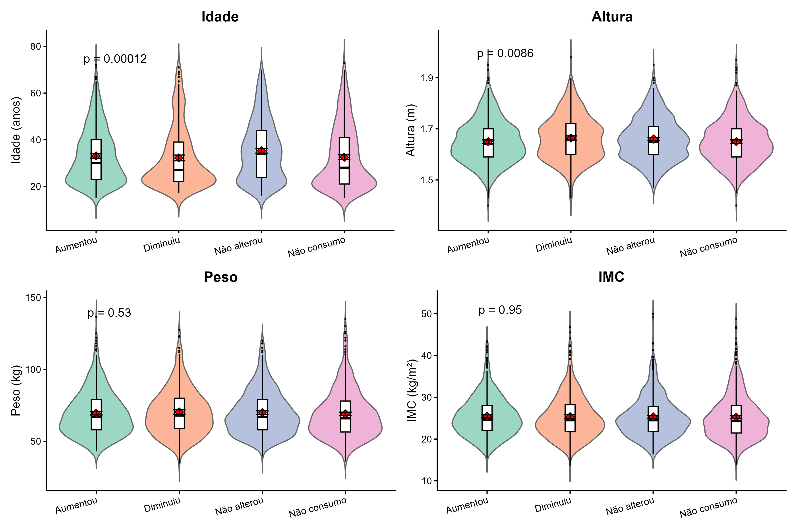

```{r}
library(gt)
library(gtsummary)

tabela <- readRDS("tabela_quali.rds")
tabela2 <- readRDS("tabela_quanti.rds")
```

#  Introdução: {.section-background}

## Contextualização:


::: {.box-blue}

- A pandemia da COVID-19 provocou mudanças sociais, econômicas e comportamentais.

- O isolamento social impactou hábitos alimentares e padrões de consumo.

- Alterações emocionais, econômicas e comportamentais podem ter influenciado os padrões de consumo durante a pandemia.

:::
<br>


::: {.box-yellow}

**Problema de pesquisa**

- Quais fatores estão associados às mudanças no consumo de bebidas alcoólicas durante a pandemia?

:::
<br>


::: {.box-gray}

**Objetivo**

- Avaliar a associação entre a variável **Bebidas_Alcoolicas** e fatores sociodemográficos, econômicos, comportamentais e emocionais.

:::

# Metodologia: {.section-background}

## Base do estudo e variáveis

:::: {.columns}

::: {.column width="45%"}

::: {.box-yellow}

<span style="color:#d4a017; font-weight:700;"> Base do estudo: </span>

- Dados coletados em 2022 por pesquisadoras da pós-graduação em Nutrição da Universidade Federal Fluminense;
- Aplicação de questionário online durante a pandemia de COVID-19;
<hr style="border: 1px dashed #d4a017; margin: 12px 0;">

- Amostra composta por 2310 participantes.
:::

<br>

::: {.box-blue}

<span style="color:#2563EB; font-weight:700;"> Variável resposta: </span> <br>

**Bebidas_Alcoolicas**
<span style="color:#8C96A0; font-size:0.72em;">
(Qualitativa nominal politômica)
</span>

<br>

**Categorias:** aumentou, diminuiu, não alterou e não consumo.
:::

:::

::: {.column width="5%"}

:::

::: {.column width="45%"}

::: {.box-gray}

<span style="color:#6B7280; font-weight:700;"> Variáveis qualitativas categóricas: </span>

- Sociodemográficas;
- Econômicas;
- Comportamentais.

<span style="color:#8C96A0; font-size:0.72em;">
Ex.: gênero, raça/cor, renda, escolaridade, tabagismo e isolamento social.
</span>

:::

<br>

::: {.box-yellow}
<span style="color:#d4a017; font-weight:700;"> Variáveis quantitativas: </span>

- Idade;
- Altura;
- Peso;
- IMC.
:::

<br>

::: {.box-blue}

<span style="color:#2563EB; font-weight:700;"> Variável aberta: </span>

- sentimentos_pandemia.

<span style="color:#8C96A0; font-size:0.72em;">
(Análises descritivas e interpretação textual.)
</span>


:::

:::

::::

## Métodos estatísticos  

::: {.columns}

::: {.column width="48%"}

::: {.box-blue}

**Variáveis qualitativas**

- Qui-quadrado de Pearson  
<span style="color:#9CA3AF;">(associação entre variáveis categóricas)</span>

- Teste exato de Fisher  
<span style="color:#9CA3AF;">(baixas frequências esperadas)</span>

- V de Cramér  
<span style="color:#9CA3AF;">(intensidade da associação)</span>

- Resíduos padronizados  
<span style="color:#9CA3AF;">(categorias com maior contribuição)</span>

:::

<br>

::: {.box-gray}

**Pacotes utilizados no R**

<span style="color:#9CA3AF; font-size:0.73em;">

- **openxlsx** → importação da base;
- **dplyr** e **tidyverse** → manipulação dos dados;
- **gtsummary** e **gt** → tabelas;
- **rstatix**, **DescTools** e **car** → testes estatísticos;
- **ggplot2**, **ggpubr** e **qqplotr** → gráficos e diagnóstico;
- **patchwork** → combinação de gráficos;
- **ggwordcloud** e **tidytext** → análise textual.

</span>

:::

:::

::: {.column width="4%"}

:::

::: {.column width="48%"}

::: {.box-blue}

**Variáveis quantitativas**

- QQ-plot e densidade  
<span style="color:#9CA3AF;">(avaliação da distribuição dos dados)</span>

- Testes de Levene e Bartlett  
<span style="color:#9CA3AF;">(homogeneidade das variâncias)</span>

- ANOVA clássica  
<span style="color:#9CA3AF;">(comparação entre médias)</span>

- ANOVA de Welch  
<span style="color:#9CA3AF;">(heterogeneidade das variâncias)</span>

- Pós-testes: Tukey e Games-Howell  
<span style="color:#9CA3AF;">(comparações múltiplas)</span>

:::

<br>

<div style="color:#7C8591; font-size:0.78em;">

Pressupostos avaliados: distribuição dos dados, homogeneidade das variâncias e frequências esperadas das tabelas de contingência.

<br><br>

Independência das observações: assumida com base no delineamento do estudo.

<br><br>

Todas as análises foram realizadas considerando nível de significância de 5% (α = 0,05).

</div>
:::

:::


#  Resultados {.section-background}

## Tabela qualitativa {.scrollable}

```{r}
tabela
```


## Magnitude das associações

<span style="color:#8C96A0; font-size:0.82em;">
As maiores magnitudes envolveram variáveis relacionadas ao contexto econômico e comportamental dos participantes.
</span>


#  Perfil das categorias: {.section-background}

## Como as categorias se comportam?

:::: {.columns}

::: {.column width="45%"}

::: {.box-yellow}

<span style="color:#d4a017; font-weight:700;">
⬆️ Perfil mais associado ao aumento do consumo
</span>

- Pessoas que trabalham;
- Maior renda;
- Maior escolaridade;
- Fumantes;
- Redução da atividade física.

<span style="color:#8C96A0; font-size:0.74em;">
Perfil associado a maior inserção econômica e mudanças comportamentais durante a pandemia.
</span>

:::

:::

::: {.column width="5%"}

:::

::: {.column width="50%"}

::: {.box-gray}

<span style="color:#6B7280; font-weight:700;">
 ⬇️ Maior presença da categoria “não consumo”
</span>

- Dificuldade financeira;
- Dificuldade de acesso a alimentos;
- Pessoas que não trabalham.

<span style="color:#8C96A0; font-size:0.74em;">
Perfil relacionado a maior vulnerabilidade econômica durante a pandemia.
</span>

:::

:::

::::

<br>


:::: {.columns}

::: {.column width="45%"}

::: {.box-blue}

**Sem associação significativa**

- Gênero;
- Consulta com nutricionista.

:::

:::

::: {.column width="5%"}

:::

::: {.column width="50%"}

::: {.box-yellow}

**Associações significativas**

- Trabalho;
- Renda familiar;
- Escolaridade;
- Dificuldade financeira;
- Acesso a alimentos;
- Isolamento social;
- Tabagismo;
- Atividade física;
- Raça/Cor;
- Tempo de preparo das refeições;
- Região;
- Profissional de saúde;
- Covid.

:::

:::

::::
<div style="margin-top:10px; color:#8C96A0; font-size:0.78em;">

Os padrões observados sugerem influência do contexto socioeconômico e da rotina vivenciada durante a pandemia sobre os perfis de consumo.

</div>

#  Variáveis quantitativas: {.section-background}

## Tabela quantitativa {.scrollable}

::: {.panel-tabset}

### Tabela

```{r}
tabela2
```

###  Gráfico violin

:::: {.columns}

::: {.column width="62%"}



:::

::: {.column width="38%"}

::: {.box-yellow}

**Idade**

- Diferenças no perfil etário entre os padrões de consumo.
- A categoria “Não alterou” apresentou maior média de idade.
- Variação mais perceptível entre as categorias analisadas.

:::

<br>

::: {.box-gray}

**Altura**

- Pequenas diferenças entre as categorias de consumo;
- Distribuições muito semelhantes entre os perfis analisados.

:::

<br>

::: {.box-blue}

**Peso e IMC**

- Ausência de mudanças relevantes entre as categorias;

- Não foi observado padrão corporal associado ao consumo.
:::

:::

::::

:::

# Aspectos emocionais: {.section-background}

## Nuvem de palavras {background-color="#000000"}


<br>

<div style="color:#8C96A0; font-size:0.82em; text-align:center;">
Ansiedade, medo e estresse apareceram como sentimentos recorrentes entre as categorias de consumo.
</div>


# Conclusão {.section-background}
## Principais achados: 


:::: {.columns}

::: {.column width="48%"}

::: {.box-blue}

<span style="color:#2563EB; font-weight:700;">
Aspectos emocionais
</span>


- Ansiedade e estresse apresentaram comportamento semelhante entre os grupos;

- O sentimento de medo apresentou leve variação visual entre as categorias.
:::

<br>

::: {.box-yellow}

<span style="color:#d4a017; font-weight:700;">
 Variáveis quantitativas
</span>

- Idade apresentou a diferença mais perceptível entre os grupos;

- Participantes mais jovens apresentaram maior associação com aumento do consumo;

- Peso e IMC não apresentaram diferenças relevantes.

:::

:::

::: {.column width="4%"}

:::

::: {.column width="48%"}

::: {.box-gray}

<span style="color:#6B7280; font-weight:700;">
Principais associações socioeconômicas:
</span>

Diversas variáveis qualitativas apresentaram associação significativa, porém

com magnitudes fracas a moderadas pelo V de Cramér.

As associações mais relevantes envolveram:

- Trabalho;
- Renda familiar;
- Escolaridade;
- Dificuldade financeira;
- Acesso a alimentos.

:::

<br>

::: {.box-yellow}

<span style="color:#d4a017; font-weight:700;">
⬆️ Perfis mais associados ao aumento do consumo
</span>

- Pessoas que trabalham;
- Maior renda e escolaridade;
- Fumantes;
- Redução da atividade física.

:::

:::

::::

<br>


::: {.box-blue}

<span style="color:#2563EB; font-weight:700;">
➡️ Síntese geral
</span>

Os padrões observados sugerem associação entre o contexto socioeconômico, a rotina vivenciada durante a pandemia e os perfis de consumo.
:::


# Fim {.section-background}